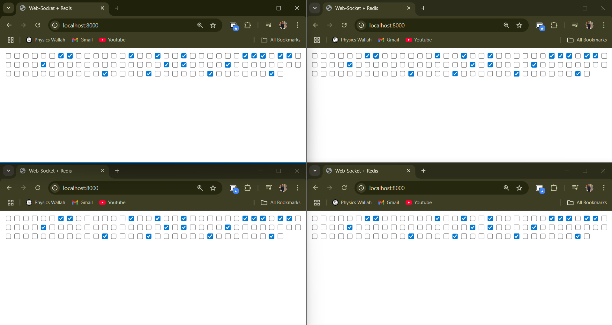
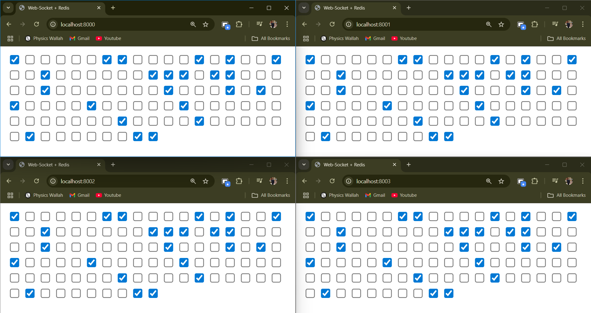

# 🔌 SocketScaler-Redis

**SocketScaler-Redis** is a mini project showcasing the first step toward scalable system design using WebSockets and Redis (Valkey). It implements horizontal WebSocket scaling and demonstrates real-time state synchronization of 100 checkboxes across multiple server instances.

---

## 🧠 Concepts Used

### 📡 WebSockets

WebSockets enable full-duplex, low-latency communication between the server and clients. Unlike HTTP, which is request-response based, WebSockets allow continuous real-time communication—ideal for real-time applications like chat, live dashboards, and collaborative tools.

### 🗄️ Redis (Valkey)

Redis is an in-memory key-value data store known for its speed and versatility. This project uses Redis not just for storing checkbox states but also for **Pub/Sub** functionality to enable **horizontal scaling** across WebSocket servers.

### 🌐 HTTP Server Role

- **Express HTTP Server** handles REST APIs (like fetching current checkbox state from `/state`).
- **Socket.IO WebSocket Server** is mounted on the same HTTP server, allowing both HTTP and WebSocket connections on the same port.

---

## 🔁 Pub/Sub Model for Horizontal Scaling

To enable synchronization between WebSocket servers running on different ports or machines:

- A **publisher** sends updates (like checkbox toggle events) to a Redis channel (`server:broker`).
- **Subscribers** (other servers) listen to that channel and relay the message to their connected WebSocket clients.

This setup ensures all connected clients, regardless of the server instance they're on, receive consistent real-time updates.

---

## 🧪 Demonstration

### ✅ 4 Socket Clients on Same Port (8000)

All clients synchronized via a single WebSocket server instance.




📹 [Video Demo](https://github.com/user-attachments/assets/753d7600-36ca-4371-b8e2-2109f81085bd)

### ✅ 4 Socket Clients on Different Ports (8000, 8001, 8002, 8003)

Each WebSocket client connected to a different server instance. Redis Pub/Sub ensures synchronization across all.



📹 [Video Demo](https://github.com/user-attachments/assets/775151ce-d72a-4aab-b2e9-c67a64096dca)

---

## ⚙️ Usage

### 🛠️ Run on Different Ports

```bash
$env:PORT=8001
npm start
```

Each instance runs on a different port but shares the same Redis backend for Pub/Sub.

---

## 🤝 Acknowledgements

- **Redis** for the blazing-fast Pub/Sub mechanism.
- **Socket.IO** for abstracting WebSocket communication with fallbacks.
- **Valkey** (a Redis alternative) for community-driven performance enhancements.

> **Made with Redis, WebSockets, and passion — by Yash Pandey**
